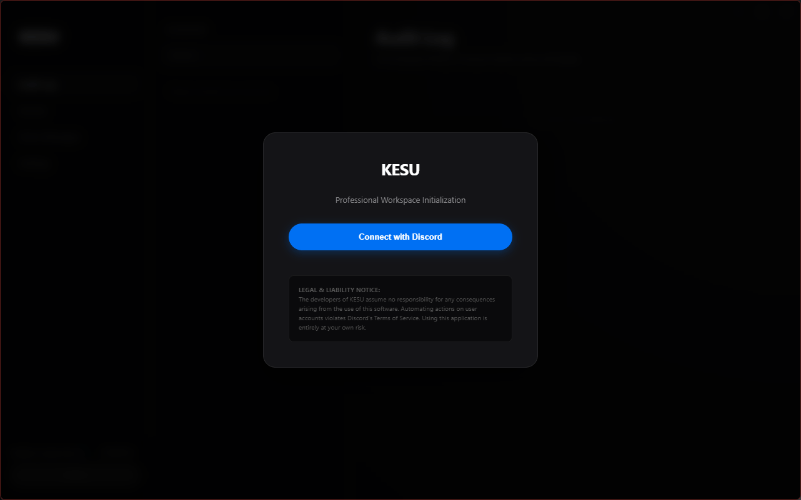

# KESU

**Professional Discord Message Manager** -- Take full control of your digital footprint.

[](LICENSE)
[](https://github.com/prsstt/KESU/releases)
[]()
[](https://www.electronjs.org/)
[](CONTRIBUTING.md)

---

KESU is a frameless Electron desktop application designed for auditing and erasing your Discord message history. It provides a unified workspace for managing messages across servers and direct conversations, with built-in rate limit handling, real-time preview, and a chronological audit log of all actions performed.



---

## Table of Contents

- [Features](#features)
- [Screenshots](#screenshots)
- [Architecture](#architecture)
- [Prerequisites](#prerequisites)
- [Installation](#installation)
- [Building from Source](#building-from-source)
- [Configuration](#configuration)
- [Usage](#usage)
- [Project Structure](#project-structure)
- [Contributing](#contributing)
- [Security](#security)
- [Changelog](#changelog)
- [Disclaimer](#disclaimer)
- [License](#license)
- [Acknowledgements](#acknowledgements)

---

## Features

- **Global Audit Log** -- Track and review a chronological history of all erasure actions performed across every target in a single timeline.
- **Multi-Target Selection** -- Select multiple servers, channels, and direct messages simultaneously for a unified wipe session.
- **Deep Message Preview** -- Reverse infinite scrolling allows you to inspect your exact messages in any channel before committing to deletion.
- **Native Media Support** -- View images, videos, and listen to audio files directly within the built-in chat interface, with a fullscreen lightbox for media inspection.
- **Selective Message Deletion** -- Select individual messages from any conversation for targeted removal instead of bulk erasure.
- **Global Purge with Stop Control** -- Launch a cross-target purge operation with the ability to halt it at any point.
- **Developer Mode** -- An advanced logging console is integrated directly into the workspace for real-time diagnostics and token inspection.
- **Smart Rate Limiting** -- Built-in delays with randomized jitter and automatic handling of Discord API rate limits ensure smooth, uninterrupted operation.
- **Secure Token Handling** -- Authentication tokens are intercepted locally via network header monitoring and never leave the device.
- **Session Persistence** -- Automatic re-authentication on application startup with secure local session storage.
- **Frameless Native UI** -- A custom-designed dark interface with window controls, sidebar navigation, and a three-panel workspace layout.
- **Auto-Update System** -- Built-in update mechanism via `electron-updater` for seamless version delivery through GitHub Releases.

---

<!-- ## Screenshots

<!-- PLACEHOLDER: Screenshots of the application will be added here -->
<!-- 

*Login screen with Discord authentication prompt.*


*Main workspace showing the three-panel layout with server channels.*


*Deep message preview with inline media rendering.*


*Global audit log tracking all erasure operations.*


*Developer mode with live diagnostic console.*


> Screenshots and a video demonstration will be added in a future update.

---
-->
## Architecture

KESU follows a standard Electron architecture with a strict separation between the main process and the renderer:

```
Main Process (main.js)
  |-- Window Management (frameless BrowserWindow)
  |-- IPC Handlers (window controls, login, session)
  |-- Token Interception (session.webRequest filter)
  |-- Auto-Updater (electron-updater via GitHub Releases)
  |
Preload Script (preload.js)
  |-- contextBridge: discordApi (fetch, delete operations)
  |-- contextBridge: appControl (window controls, login triggers)
  |
Renderer Process (index.html)
  |-- Single-Page Application (vanilla JS, CSS custom properties)
  |-- Views: Audit Log, Servers, Direct Messages, Settings, Preview
  |-- Modal System, Lightbox, Developer Console
```

Key design decisions:

- **Context Isolation** is enabled with `nodeIntegration: false` for security.
- **No external frontend framework** -- the entire UI is built with vanilla HTML, CSS, and JavaScript in a single `index.html` file for simplicity and minimal footprint.
- **Discord API calls** are made directly from the preload script via `fetch()`, keeping token handling within the Electron sandbox.
- **WebAuthn blocking** prevents the Windows security key prompt from interrupting the login flow.

---

## Prerequisites

Before building or running KESU from source, ensure you have the following installed:

- [Node.js](https://nodejs.org/) v18 or later (LTS recommended)
- [npm](https://www.npmjs.com/) v9 or later (ships with Node.js)
- [Git](https://git-scm.com/) for cloning the repository

---

## Installation

### From Releases (Recommended)

Download the latest pre-built Windows installer from the [Releases](https://github.com/prsstt/KESU/releases) page. Run the `.exe` installer and follow the on-screen instructions.

The installer supports:
- Custom installation directory
- Desktop and Start Menu shortcut creation
- Automatic updates after installation

### From Source

Clone the repository and install dependencies:

```bash
git clone https://github.com/prsstt/KESU.git
cd KESU
npm install
```

Start the application in development mode:

```bash
npm start
```

---

## Building from Source

To build a standalone Windows installer (NSIS):

```bash
npm run build
```

The generated installer and unpacked application will be placed in the `dist/` directory.

Build output:
- `dist/Kesu Setup X.X.X.exe` -- NSIS installer
- `dist/win-unpacked/` -- portable, unpacked application

---

## Configuration

KESU requires no manual configuration files. All settings are managed through the in-app Settings panel:

| Setting | Description |
|---|---|
| Developer Mode | Enables the diagnostic logging console at the bottom of the workspace. Provides access to token reveal, test logging, and console clearing. |
| Account Session | Allows secure logout, clearing all stored authentication data and Discord cookies from the device. |

Authentication tokens are stored in the renderer's `localStorage` and are never written to disk files or transmitted externally.

---

## Usage

1. **Launch** the application and click "Connect with Discord" on the login screen.
2. **Authenticate** with your Discord credentials in the modal browser window. Your token is captured automatically.
3. **Navigate** between Servers, Direct Messages, Audit Log, and Settings using the sidebar.
4. **Select targets** by checking channels or DMs you want to process. Use "Select All" for bulk selection.
5. **Preview messages** by clicking on a channel name (or the "Preview" button on server channels) to inspect your message history with infinite scroll.
6. **Erase** by clicking the "Erase" button in the sidebar panel. Confirm the operation in the modal dialog.
7. **Monitor** the process in real-time via the Audit Log and optional Developer Console.
8. **Stop** any running purge operation at any time using the "STOP PROCESS" button.

---

## Project Structure

```
KESU/
|-- main.js              # Electron main process (window management, IPC, auto-updater)
|-- preload.js           # Context bridge (Discord API bindings, app controls)
|-- index.html           # Single-page renderer (UI, styles, application logic)
|-- package.json         # Project metadata, dependencies, build configuration
|-- favicon.ico          # Application favicon
|-- build/
|   |-- icon.ico         # Application icon for the installer and window
|-- dist/                # Build output (gitignored)
|-- node_modules/        # Dependencies (gitignored)
|-- LICENSE              # MIT License
|-- README.md            # This file
|-- CONTRIBUTING.md      # Contribution guidelines
|-- CODE_OF_CONDUCT.md   # Community code of conduct
|-- SECURITY.md          # Security policy and vulnerability reporting
|-- CHANGELOG.md         # Release history
```

---

## Contributing

Contributions are welcome and appreciated. Whether it is a bug report, feature request, documentation improvement, or code contribution, every effort helps make KESU better.

Please read [CONTRIBUTING.md](CONTRIBUTING.md) before submitting your first pull request. It covers the development workflow, coding standards, and review process.

---

## Security

KESU handles Discord authentication tokens locally. If you discover a security vulnerability in this application, please refer to our [Security Policy](SECURITY.md) for responsible disclosure guidelines.

**Important:** Tokens are stored exclusively in the renderer's `localStorage`. They are never transmitted to any external server, logged to files, or exposed outside the application sandbox.

---

## Changelog

See [CHANGELOG.md](CHANGELOG.md) for a detailed list of changes across all releases.

---

## Disclaimer

**The developers of KESU assume no responsibility for any consequences arising from the use of this software.** Automating actions on user accounts may violate Discord's Terms of Service. Users are solely responsible for ensuring their usage complies with all applicable terms, policies, and laws. Using this application is entirely at your own risk.

This tool is provided as-is for educational and personal data management purposes. The authors do not endorse or encourage any activity that violates third-party terms of service.

---

## License

Distributed under the **MIT License**. See [LICENSE](LICENSE) for the full license text.

---

## Acknowledgements

- [Electron](https://www.electronjs.org/) -- Cross-platform desktop application framework
- [electron-builder](https://www.electron.build/) -- Packaging and distribution toolchain
- [electron-updater](https://www.electron.build/auto-update) -- Auto-update mechanism for Electron apps
- [axios](https://axios-http.com/) -- HTTP client (dependency)
- [Discord API](https://discord.com/developers/docs/) -- Underlying API for message operations
